# 创建全景应用

<!-- toc -->

**注意：本应用使用DJI SDK和OpenCV开发，适配DJI Inspire1和Phantom 3 Professional**

## 配置和运行全景应用

### 配置开发环境

你需要下载并配置以下8个开发环境，括号内的是本示例使用的版本：

 1. [Java Devlopment Kit](http://www.ntu.edu.sg/home/ehchua/programming/howto/JDK_Howto.html) (jdk 8u45)
 2. [Eclipse](http://www.eclipse.org/downloads/) (Eclipse Mars) 
 3. [Eclipse Android Development Tools](http://developer.android.com/sdk/installing/installing-adt.html) (ADT 23.0.6) 
 4. [Android Native Development Kit](http://developer.android.com/ndk/guides/setup.html) (ndk r10e) 
 5. [Eclipse C/C++ Development Tooling](http://eclipse.org/cdt/) (cdt8.7.0)  参照这个教程完成配置: http://www.ibm.com/developerworks/opensource/library/os-ecc/?S_TACT=105AGX44&S_CMP=ART
 6. [Cygwin](http://www.cygwin.com) (cygwin2.1.0)相关教程: http://mindtherobot.com/blog/452/android-beginners-ndk-setup-step-by-step/
 7. [OpenCV](http://opencv.org) (OpenCV2.4.11) 下载 "OpenCV for Android"
 8. [DJI Software Development Kit](http://dev.dji.com) (DJI SDK 2.3.0)

### 导入工程到Eclipse

我们已经发布了一个可运行版本，你从这里下载：

https://github.com/evan2048/PanoDemo

1.打开Eclipse->File->Import->General->Existing Projects into Workspace->Select root directory->Browse.选择下载好的"PanoDemo":

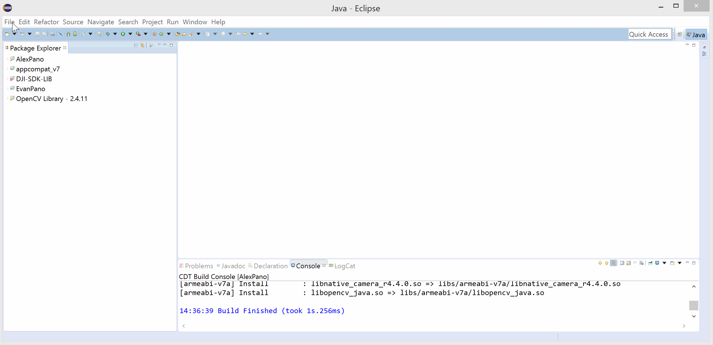

2.勾选以下三个项目:

3.点击完成按钮等待项目编译完成，在左侧Package Explorer，右键点击“PanoDemo”-> Properties -> Android,检查"Libraries"里 是否有"OpenCV Library"和"DJI-SDK-LIB"，如果没有，则点击添加按钮添加：

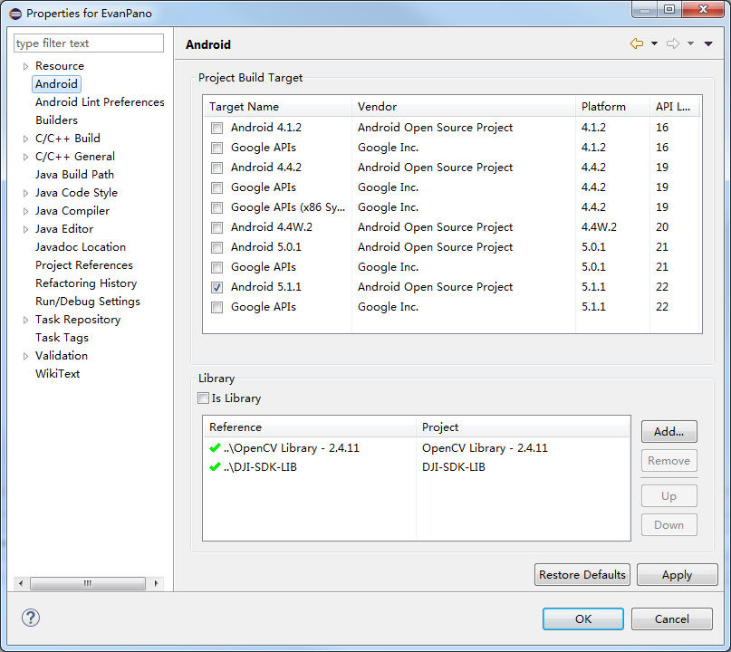

4.打开jni目录下的“Android.mk”文件，添加以下行包含OpenCV库。

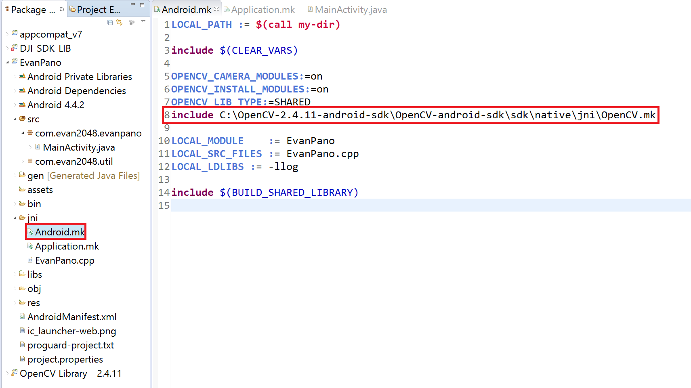

5.根据组件的具体安装位置，在系统环境变量中添加以下几项，重启电脑生效：

 - C:\Program Files\Java\jdk1.8.0_45\bin;
 - D:\DJI\PanoramaDemo\release\NDK\android-ndk-r10e;
 - D:\DJI\PanoramaDemo\release\NDK\android-ndk-r10e\build;
 - D:\DJI\PanoramaDemo\release\NDK\android-ndk-r10e\prebuilt\windows-x86_64\bin
 - C:\OpenCV-2.4.11-android-sdk\OpenCV-android-sdk\sdk\native\jni;

### 使用全景应用

在安卓设备上运行“PanoDemo”（基础教程：[点击这里](http://developer.android.com/tools/building/building-eclipse.html)）安装到设备上之后，使用USB线连接设备到遥控器，打开遥控器和飞行器，运行“PanoDemo”。

--

运行应用时，你将看到这个界面，点击“Start”按钮开始，如果“Start”按钮是灰色的，则手机与遥控器连接有问题，插拔重试一下。

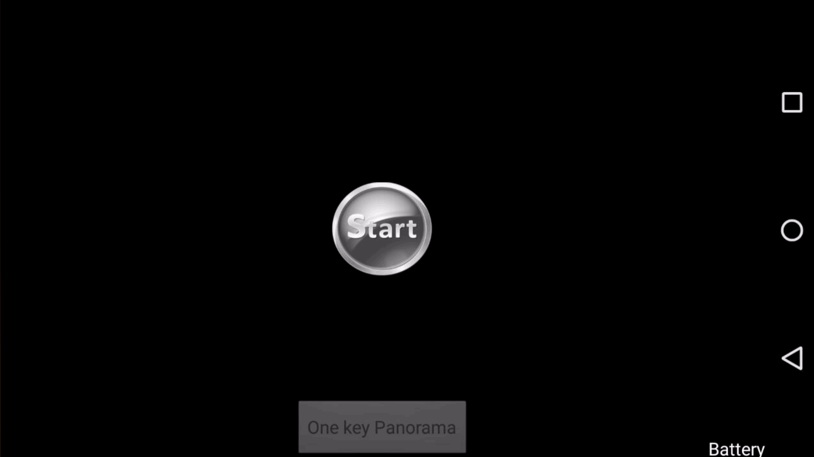

点击“Start”按钮后，将看到实时预览画面，点击“One key Panorama”即可进行自动拍摄全景照片。

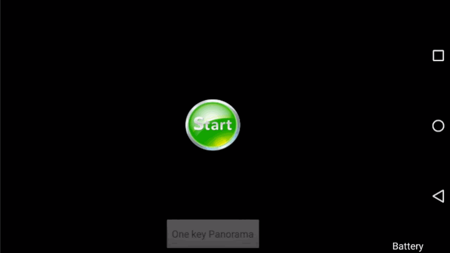

每隔45度角拍摄一次共八张照片完成之后，弹出对话框选择“OK”则会开始合成全景照片。

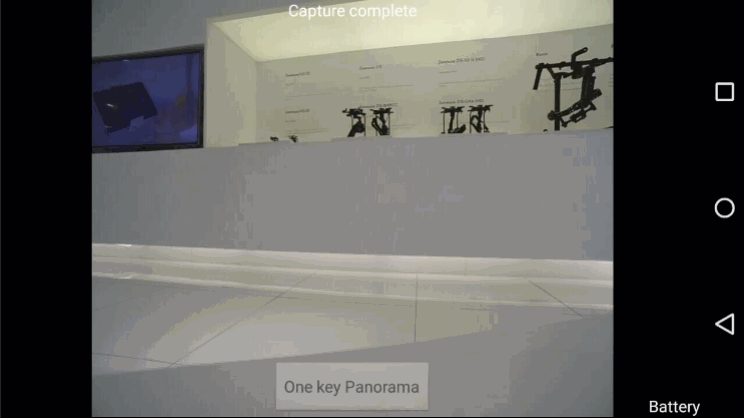

界面显示刚刚拍摄的八张照片，等待程序自动选择完成，用户无需干预。

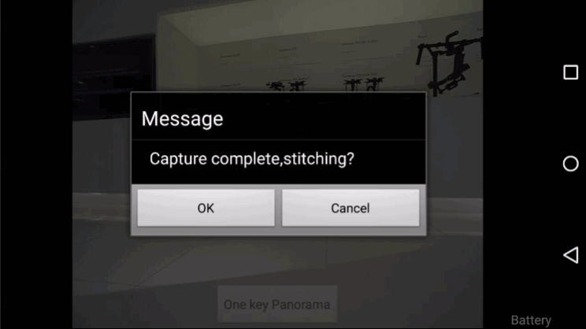

应用将会自动合成全景图，此时我们将实时预览画面关闭，节约设备CPU和内存占用，根据不同手机的性能，这个过程将会持续几分钟。

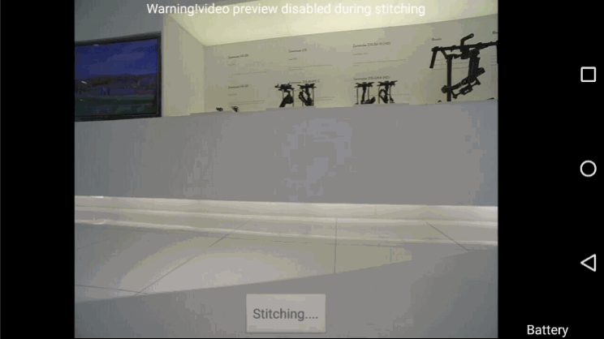

当弹出合成成功的对话框时，你可以查看刚刚完成的全景图。

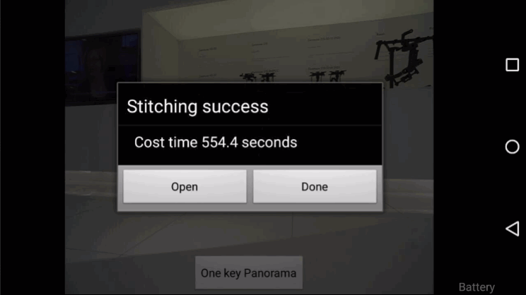

### 创建你自己的全景图应用

现在你已经完成了这个例程的配置，接下来你可以创建你自己的全景图应用。

例程流程图如下：

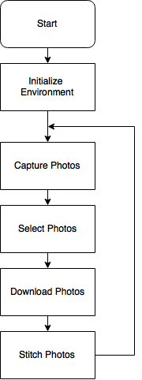

接下来我们一步一步的按照流程图创建我们自己的应用，取名为“MainActivity”。

首选在Eclipse中导入DJI SDK和OpenCV库，这两个库可以在下载的PanoDemo目录中找到。

在Package Explorer中右键点击“PanoDemo”-> Properties -> Android,检查"Libraries"里 是否有"OpenCV Library"和"DJI-SDK-LIB"，如果没有，则点击添加按钮添加：

## 创建用户界面

### 应用权限和基本布局

在**AndroidManifest.xml**中添加以下权限:

~~~xml
<uses-permission android:name="android.permission.INTERNET" />
    <uses-permission android:name="android.permission.ACCESS_WIFI_STATE" />
    <uses-permission android:name="android.permission.WAKE_LOCK" />
    <uses-permission android:name="android.permission.ACCESS_COARSE_LOCATION" />
    <uses-permission android:name="android.permission.ACCESS_NETWORK_STATE" />
    <uses-permission android:name="android.permission.ACCESS_FINE_LOCATION" />
    <uses-permission android:name="android.permission.CHANGE_WIFI_STATE" />
    <uses-permission android:name="android.permission.MOUNT_UNMOUNT_FILESYSTEMS" />
    <uses-permission android:name="android.permission.WRITE_EXTERNAL_STORAGE" />
    <uses-permission android:name="android.permission.READ_EXTERNAL_STORAGE" />
    <uses-permission android:name="android.permission.READ_PHONE_STATE" />
    <uses-permission android:name="android.permission.RECORD_AUDIO" />
    <uses-permission android:name="android.permission.MODIFY_AUDIO_SETTINGS" />
    <uses-permission android:name="android.permission.CAMERA" />

    <uses-feature
        android:name="android.hardware.camera"
        android:required="false" />
    <uses-feature
        android:name="android.hardware.camera.autofocus"
        android:required="false" />
    <uses-feature
        android:name="android.hardware.camera.front"
        android:required="false" />
    <uses-feature
        android:name="android.hardware.camera.front.autofocus"
        android:required="false" />
    <uses-feature
        android:name="android.hardware.usb.accessory"
        android:required="false" />
    <uses-feature
        android:name="android.hardware.usb.host"
        android:required="false" />
~~~

通过USB连接DJI遥控器和读写外部存储的权限非常重要。

在**AndroidManifest.xml**文件中, 在**<application** **... >**配置如下:

~~~xml
<application
	// These 3 lines should have been automatically generated
    android:allowBackup="true"
    android:icon="@drawable/ic_launcher"
    android:label="@string/app_name"

	// This one too, but we're deleting it
	// android:theme="@style/AppTheme"

 	// Add these 2 lines
    android:theme="@android:style/Theme.NoTitleBar.Fullscreen" 
    android:hardwareAccelerated="true">

	// Note that this line comes right after the opening tag, not inside of it
	<uses-library android:name="com.android.future.usb.accessory" />
~~~

在**MainActivity** **<activity** **... >**中, 添加以下代码:

~~~xml
<activity
	android:name=".MainActivity"
	android:label="@string/app_name"

	...

	// Add this line
	android:screenOrientation="landscape" >

	...

	// Add these lines
	<intent-filter>
		<action android:name="android.hardware.usb.action.USB_ACCESSORY_ATTACHED" />
	</intent-filter>

	<meta-data
		android:name="android.hardware.usb.action.USB_ACCESSORY_ATTACHED"
		android:resource="@xml/accessory_filter" />

~~~

第一行设置应用为landscape视图。

设置**MainActivity**类继承**Activity**.

在**onCreate()**中添加以下行，使得屏幕保持常亮。

~~~java
@Override
protected void onCreate(Bundle savedInstanceState)
{
    super.onCreate(savedInstanceState);

	// Keep screen on
    getWindow().addFlags(WindowManager.LayoutParams.FLAG_KEEP_SCREEN_ON);

    setContentView(R.layout.activity_main);
}
~~~

运行应用，你将会看到应用以landscape视图没有标题栏全屏显示。

### 创建用户界面

应用主要包含以下几个部件：

 - **mDjiGLSurfaceView** - SDK提供的一个控件，用于显示实时航拍画面。

 - **commonMessageTextView** - 用于显示状态信息。

 - **startButton** - 开启实时航拍画面显示。

 - **stitchingButton** - 自动拍摄照片，合成全景图。

还有一个**batteryTextView**用于显示飞行器电量。

**activity_main.xml**如下：

~~~xml
<dji.sdk.widget.DjiGLSurfaceView
    android:id="@+id/mDjiSurfaceView"
    android:layout_width="match_parent"
    android:layout_height="match_parent" />

<LinearLayout
    android:id="@+id/centerLinearLayout"
    android:layout_width="wrap_content"
    android:layout_height="wrap_content"
    android:layout_centerHorizontal="true"
    android:layout_centerVertical="true"
    android:orientation="vertical" >

    <Button
        android:id="@+id/startButton"
        android:layout_width="80dp"
        android:layout_height="75dp"
        android:layout_gravity="center_horizontal"
        android:background="@drawable/start_gray" />
</LinearLayout>

<TextView
    android:id="@+id/commonMessageTextView"
    android:layout_width="wrap_content"
    android:layout_height="wrap_content"
    android:layout_alignParentTop="true"
    android:layout_centerHorizontal="true"
    android:gravity="center_horizontal"
    android:text="@string/commonMessageString"
    android:textColor="@android:color/white" />

<Button
    android:id="@+id/stitchingButton"
    android:layout_width="wrap_content"
    android:layout_height="wrap_content"
    android:layout_alignParentBottom="true"
    android:layout_centerHorizontal="true"
    android:text="@string/stitching" />
~~~

在我们示例中PanoDemo\res\drawable-mdpi下有个**start_gray**的图片，你可以拷到你的项目中使用。

**strings.xml**资源如下：

~~~xml
<!-- UI -->
    <string name="dji_sdk_activate_error">DJI SDK activation error</string>
    <string name="stitching">Stitching</string>
    <string name="one_key_panorama">One Button Panorama</string>
    <string name="commonMessageString">Common message</string>
    <string name="groundstation_take_control">Caution! GroundStation taking control now</string>
    <string name="init_gimabal_yaw">Initializing gimbal....</string>
    <string name="test">Test</string>
    <string name="capturing_image">Capturing</string>
    <string name="capture_image_complete">Capture complete</string>
    <string name="downloading">Downloading</string>
    <string name="battery">Battery</string>
    <string name="pressAgainExitString">Press again to exit</string>
    <string name="unsupported_drone">Unsupported drone, use Inspire1 or Phantom 3 pro and try again</string>
    <string name="video_preview_disabled_during_stitching">Warning! Video preview disabled during stitching</string>
~~~

在**onCreate**中调用**initUIControls()**：

~~~java
@Override
	protected void onCreate(Bundle savedInstanceState)
	{
		super.onCreate(savedInstanceState);
		getWindow().addFlags(WindowManager.LayoutParams.FLAG_KEEP_SCREEN_ON);
		setContentView(R.layout.activity_main);
		//onCreate init
		initUIControls();
	}
~~~

在**MainActivity**定义这些控件:

~~~java
private DjiGLSurfaceView mDjiGLSurfaceView;
private TextView commonMessageTextView;
private LinearLayout centerLinearLayout;
private Button startButton;
private Button stitchingButton;
private ProgressDialog mDownloadDialog;
~~~

创建**initUIControls()**函数:

~~~java
private void initUIControls()
{
    //Assign variables to their corresponding views
    mDjiGLSurfaceView=(DjiGLSurfaceView)findViewById(R.id.mDjiSurfaceView);
    commonMessageTextView=(TextView)findViewById(R.id.commonMessageTextView);
    centerLinearLayout=(LinearLayout)findViewById(R.id.centerLinearLayout);
    startButton=(Button)findViewById(R.id.startButton);
    stitchingButton=(Button)findViewById(R.id.stitchingButton);

    //Add Listeners for buttons
    startButton.setOnClickListener(this);
    stitchingButton.setOnClickListener(this);

    //Customize controls
    commonMessageTextView.setText("");
    startButton.setClickable(false);
    stitchingButton.setEnabled(false);
    stitchingButton.setText(getString(R.string.one_key_panorama));
}
~~~

这个函数包含三项：找到控件，添加事件监听器，自定义控件行为。

~~~java
private void initDownloadProgressDialog()
{
    mDownloadDialog = new ProgressDialog(MainActivity.this);
    mDownloadDialog.setTitle(R.string.downloading);
    mDownloadDialog.setIcon(android.R.drawable.ic_dialog_info);
    mDownloadDialog.setProgressStyle(ProgressDialog.STYLE_HORIZONTAL);
    mDownloadDialog.setCanceledOnTouchOutside(false);
    mDownloadDialog.setCancelable(false);
}
~~~

在**initUIControls()**后面调用**initDownloadProgressDialog()**:

~~~
private void initUIControls()
{
    ...

	initDownloadProgressDialog();
}
~~~

在上面设置事件监听器后，接下来实现点击事件。

~~~
public class MainActivity extends ActionBarActivity implements OnClickListener {
...
}
~~~

编译并运行，你将看到刚刚创建好的应用界面：

## 初始化和设置

### 初始化应用环境

界面做好了，接下来实现功能：

**initStitchingImageDirectory()** 里将会创建两个目录用于存放从飞行器下载的图片和合成好的图片，用你自己的应用名替换“APPNAME”

~~~java
private final String STITCHING_SOURCE_IMAGES_DIRECTORY = Environment.getExternalStorageDirectory().getPath()+"/APPNAME/";
private final String STITCHING_RESULT_IMAGES_DIRECTORY = Environment.getExternalStorageDirectory().getPath()+"/APPNAME/result/";
~~~

**initStitchingImageDirectory()**如下：

~~~java
private void initStitchingImageDirectory()
{
    //check if directories already exist. If not, create
    File sourceDirectory = new File(STITCHING_SOURCE_IMAGES_DIRECTORY);
    if(!sourceDirectory.exists())
    {
        sourceDirectory.mkdirs();
    }
    File resultDirectory = new File(STITCHING_RESULT_IMAGES_DIRECTORY);
    if(!resultDirectory.exists())
    {
        resultDirectory.mkdirs();
    }
}
~~~

**initStitchingImageDirectory()**检查目录是否存在，如果不存在，则创建。

**initOpenCVLoader()**首先会尝试调用包内的OpenCV库，如果失败，则尝试从外部调用。

~~~java
private boolean initOpenCVLoader()
{
    if (!OpenCVLoader.initDebug())
    {
        // Handle initialization error
        showLOG("init buildin OpenCVLoader error,going to use OpenCV Manager");
        OpenCVLoader.initAsync(OpenCVLoader.OPENCV_VERSION_2_4_3, this, mLoaderCallback);
        return false;
    }
    else
    {
        showLOG("init buildin OpenCVLoader success");
        return true;
    }
}
~~~

你可以从http://opencv.org里找到相关的函数说明。

添加以下回调:

~~~java
private static final String TAG = "APPNAMEMainActivity";  //debug TAG. Edit to suit the name of your own app

private void showLOG(String str)
{
    Log.e(TAG, str);
}

private BaseLoaderCallback mLoaderCallback = new BaseLoaderCallback(this) {
    @Override
    public void onManagerConnected(int status) {
        switch (status) {
            case LoaderCallbackInterface.SUCCESS:
            {
                showLOG("OpenCV Manager loaded successfully");
                break;
            }
            default:
            {
                super.onManagerConnected(status);
                break;
            }
        }
    }
};
~~~

showLOG函数用于打印调试信息。

**initDjiSDK()**用于配置USB连接，激活DJI SDK，连接到飞行器。

~~~java
private void initDJISDK()
{
    startDJIAoa();
    activateDJISDK();

    // The SDK initiation for Inspire 1
    DJIDrone.initWithType(this.getApplicationContext(), DJIDroneType.DJIDrone_Inspire1);
    DJIDrone.connectToDrone(); // Connect to the drone
}
~~~

这里我们将飞机初始化为Inspire1，但是我们应用支持Inspire1和Phantom 3 Professional，这是因为这二者主控是一样的，可以通用。

在新版SDK中，必须使用USB AOA与遥控器进行连接，代码如下：

~~~java
private static boolean isDJIAoaStarted = false;  //DJIAoa

private void startDJIAoa()
{
    if(isDJIAoaStarted)
    {
        //Do nothing
        showLOG("DJIAoa aready started");
    }
    else
    {
        ServiceManager.getInstance();
        UsbAccessoryService.registerAoaReceiver(this);
        isDJIAoaStarted = true;
        showLOG("DJIAoa start success");
    }
    Intent aoaIntent = getIntent();
    if(aoaIntent != null)
    {
        String action = aoaIntent.getAction();
        if(action==UsbManager.ACTION_USB_ACCESSORY_ATTACHED || action == Intent.ACTION_MAIN)
        {
            Intent attachedIntent = new Intent();
            attachedIntent.setAction(DJIUsbAccessoryReceiver.ACTION_USB_ACCESSORY_ATTACHED);
            sendBroadcast(attachedIntent);
        }
    }
}
~~~

添加**activateDJISDK()**:

~~~java
pprivate void activateDJISDK()
{
    new Thread()
    {
        public void run()
        {
            try
            {
                DJIDrone.checkPermission(getApplicationContext(), new DJIGerneralListener()
                {
                    @Override
                    public void onGetPermissionResult(int result)
                    {
                        //result=0 is success
                        showLOG("DJI SDK onGetPermissionResult = "+result);
                        showLOG("DJI SDK onGetPermissionResultDescription = "+DJIError.getCheckPermissionErrorDescription(result));
                        if(result!=0)
                        {
                            showToast(getString(R.string.dji_sdk_activate_error)+":"+DJIError.getCheckPermissionErrorDescription(result));
                        }
                    }
                });
            }
            catch(Exception e)
            {
                showLOG("activateDJISDK() Exception");
                showToast("activateDJISDK() Exception");
                e.printStackTrace();
            }
        }
    }.start();
}
~~~

如何创建航拍相机： [How to Create a Camera Application](http://dji-dev.gitbooks.io/mobile-sdk-tutorials/content/en/Android/FPVDemo/Part1/FPVDemo_Part1_en.html)。

**showToast()**用于打印调试信息：

~~~java
private void showToast(String str)
{
    Toast.makeText(this, str, Toast.LENGTH_SHORT).show();
}
~~~

**initDJICamera()**中**CheckCameraConnectionTask()**每隔三秒检测一次相机连接状态：

~~~java
private Timer checkCameraConnectionTimer = new Timer();
private void initDJICamera()
{
    //check camera status every 3 seconds
    checkCameraConnectionTimer.schedule(new CheckCameraConnectionTask(), 1000, 3000);
}
~~~

**CheckCameraConnectionTask**检测相机连接状态，若连接成功，“Start”按钮变绿色，否则为灰色。

~~~java
class CheckCameraConnectionTask extends TimerTask
{
    @Override
    public void run()
    {
        if(checkCameraConnectState()==true)
        {
            runOnUiThread(new Runnable() {
                public void run() {
                    startButton.setBackgroundResource(R.drawable.start_green);
                    startButton.setClickable(true);
                }
            });
        }
        else
        {
            runOnUiThread(new Runnable() {
                public void run() {
                    startButton.setBackgroundResource(R.drawable.start_gray);
                    startButton.setClickable(false);
                    stitchingButton.setEnabled(false);
                }
            });
        }
    }
}
private boolean checkCameraConnectState(){
    //check connection
    boolean cameraConnectState = DJIDrone.getDjiCamera().getCameraConnectIsOk();
    if(cameraConnectState)
    {
        //showLOG("DJI Camera connect ok");
        return true;
    }
    else
    {
        //showLOG("DJI Camera connect failed");
        return false;
    }
}
~~~

在**onCreate()**中调用：

~~~java
@Override
protected void onCreate(Bundle savedInstanceState)
{
    super.onCreate(savedInstanceState);
	// Keep screen on
    getWindow().addFlags(WindowManager.LayoutParams.FLAG_KEEP_SCREEN_ON);
    setContentView(R.layout.activity_main);

    //onCreate init
    initUIControls();
    initStitchingImageDirectory();
    initOpenCVLoader();
    initDJISDK();
    initDJICamera();
}
~~~

运行应用，初始如下：

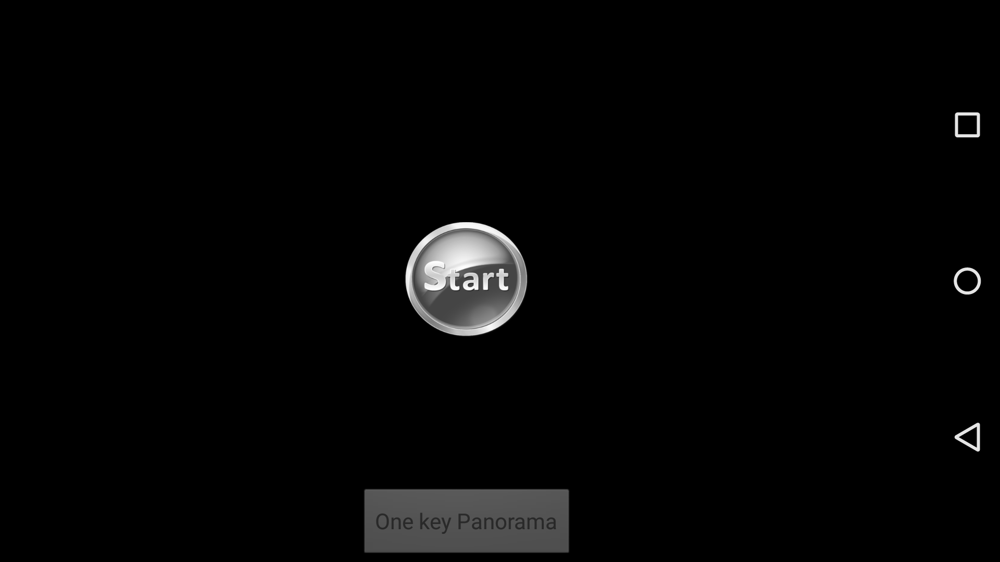

连接上飞行器后：

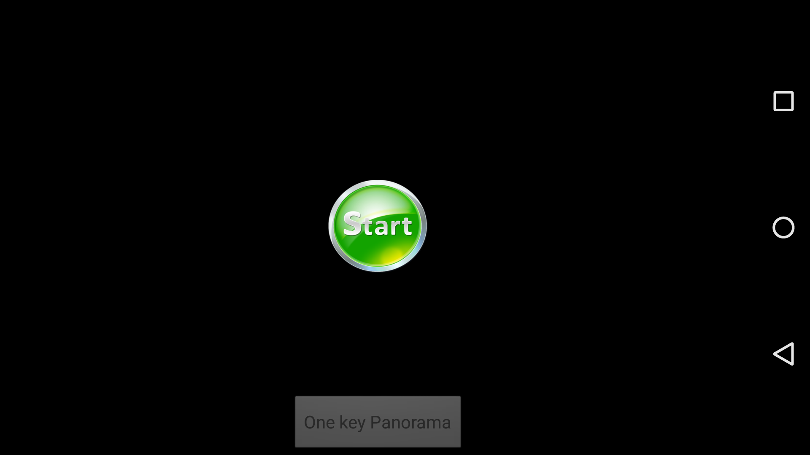

### 与飞行器通信：

与飞行器通信相关的如下：

~~~java
private DJIDroneType mDroneType;

//Callback functions to implement
private DJIReceivedVideoDataCallBack mReceivedVideoDataCallBack;
private DJIGimbalErrorCallBack mGimbalErrorCallBack;
private DJICameraPlayBackStateCallBack mCameraPlayBackStateCallBack;  //to get currently selected pictures count

private DJIGimbalCapacity mDjiGimbalCapacity;
private int numbersOfSelected = 0;  //updated from mCameraPlayBackStateCallBack
private final int COMMON_MESSAGE_DURATION_TIME = 2500;  //in milliseconds
~~~

显示消息将会持续**COMMON_MESSAGE_DURATION_TIME**时间：

~~~java
private Timer commonMessageTimer = new Timer();

class commonMessageCleanTask extends TimerTask
{
    @Override
    public void run()
    {
        runOnUiThread(new Runnable()
        {
            public void run()
            {
                commonMessageTextView.setText("");
            }
        });
    }
}

private void showCommonMessage(final String message)
{
    runOnUiThread(new Runnable()
    {           
        @Override
        public void run()
        {
            if(message.equals(commonMessageTextView.getText()))
            {
                //filter same message
                return;
            }
            commonMessageTextView.setText(message);
            commonMessageTimer.schedule(new commonMessageCleanTask(), COMMON_MESSAGE_DURATION_TIME);
        }
    });
}
~~~

**startDJICamera()**开启实时预览画面，打开相关的回调函数:

~~~java
private void startDJICamera() {
    // check drone type
    mDroneType = DJIDrone.getDroneType();

	// start SurfaceView
    mDjiGLSurfaceView.start();

    // decode video data
    mReceivedVideoDataCallBack = new DJIReceivedVideoDataCallBack() {
        @Override
        public void onResult(byte[] videoBuffer, int size) {
            mDjiGLSurfaceView.setDataToDecoder(videoBuffer, size);
        }
    };

    mGimbalErrorCallBack = new DJIGimbalErrorCallBack() {
        @Override
        public void onError(final int error) {
            if (error != DJIError.RESULT_OK) {
                runOnUiThread(new Runnable() {
                    public void run() {
                        showCommonMessage("Gimbal error code=" + error);
                    }
                });
            }
        }
    };

    mCameraPlayBackStateCallBack = new DJICameraPlayBackStateCallBack() {
        @Override
        public void onResult(DJICameraPlaybackState mState) {
            numbersOfSelected = mState.numbersOfSelected;
        }
    };

    DJIDrone.getDjiCamera().setReceivedVideoDataCallBack(
            mReceivedVideoDataCallBack);
    DJIDrone.getDjiGimbal().setGimbalErrorCallBack(mGimbalErrorCallBack);
    DJIDrone.getDjiCamera().setDJICameraPlayBackStateCallBack(
            mCameraPlayBackStateCallBack);

    DJIDrone.getDjiGimbal().startUpdateTimer(1000);
}
~~~

**mDroneType**用于确定当前连接的是Inspire1还是Phantom 3 Professional。

点击“Start”按钮调用startDJICamera().

~~~java
@Override
public void onClick(View v) {
    switch (v.getId()) {
        case R.id.startButton:

			// start dji camera
            startDJICamera();

            centerLinearLayout.setVisibility(View.INVISIBLE); // hide startButton
            stitchingButton.setEnabled(true);
            break;
        default:
            break;
    }

}
~~~

## 拍照

### 开始全景

现在我们能连接到飞行器，看到实时画面了，接下来进行全景拍摄流程：

~~~java
case R.id.stitchingButton:
	cleanSourceFolder();
	stitchingButton.setEnabled(false);
	stitchingButton.setText(getString(R.string.one_key_panorama));

	if(mDroneType==DJIDroneType.DJIDrone_Inspire1)
	{
		handler.sendMessage(handler.obtainMessage(HANDLER_INSPIRE1_CAPTURE_IMAGES,""));
	}
	else
	{
		showCommonMessage(getString(R.string.unsupported_drone));
	}
	break;
~~~

清空全景图目录，但是保留了result目录，所以全景图不会被删除。

~~~java
private void cleanSourceFolder()
{
    File sourceDirectory = new File(STITCHING_SOURCE_IMAGES_DIRECTORY);
    //clean source file, except folders
    for(File file : sourceDirectory.listFiles())
    {
        if(!file.isDirectory())
        {
            file.delete();
        }
    }
}
~~~

**STITCHING_SOURCE_IMAGES_DIRECTORY**定义的就是图片存储目录。

~~~java
private final String STITCHING_SOURCE_IMAGES_DIRECTORY = Environment.getExternalStorageDirectory().getPath()+"/APPNAME/";
~~~

接下来介绍图片处理过程：

创建handler:

~~~java
private Handler handler = new Handler(new Handler.Callback() {
	@Override
	public boolean handleMessage(Message msg)
	{
		// handleMessage code
	}
});
~~~

~~~java
switch (msg.what)
{
	case HANDLER_INSPIRE1_CAPTURE_IMAGES:
	// capture images code
	break;
}
~~~

### 拍摄照片

我们每隔45度角拍摄一张，共拍摄八张。

添加以下变量:

~~~java
private final int HANDLER_SHOW_COMMON_MESSAGE = 1000;
private final int HANDLER_SET_STITCHING_BUTTON_TEXT = 1001;
private final int HANDLER_ENABLE_STITCHING_BUTTON = 1003;
private final int HANDLER_SHOW_STITCHING_OR_NOT_DIALOG = 1005;
private final int CAPTURE_IMAGE_GIMBAL_INIT_POSITION = -2300;  //-2300 for inspire1
private final int HANDLER_INSPIRE1_CAPTURE_IMAGES = 2000;

private final int CAPTURE_IMAGE_NUMBER = 8;  //number of images to take to form a panorama
private int captureImageFailedCount = 0;
private boolean isCheckCaptureImageFailure = false;  //check dji camera capture result
~~~

**HANDLER_INSPIRE1_CAPTURE_IMAGES**拍照：

~~~java
case HANDLER_INSPIRE1_CAPTURE_IMAGES:
{
    new Thread()
    {
        public void run()
        {
            //rotate gimble to take photos
            int imgIndex=0;
            showCommonMessage(getString(R.string.init_gimabal_yaw));
            //init the gimbal yaw to Clockwise Min
            while(DJIDrone.getDjiGimbal().getYawAngle()>CAPTURE_IMAGE_GIMBAL_INIT_POSITION)
            {
                DJIGimbalRotation mYaw_relative = new DJIGimbalRotation(true,false,false, 1000);
                DJIDrone.getDjiGimbal().updateGimbalAttitude(null,null,mYaw_relative);
                try
                {
                    sleep(50);
                }
                catch(InterruptedException e)
                {
                    e.printStackTrace();
                }
            }
            DJIGimbalRotation mYaw_init_stop = new DJIGimbalRotation(true,false,false, 0);
            DJIDrone.getDjiGimbal().updateGimbalAttitude(null,null,mYaw_init_stop);
            try
            {
                sleep(50);
            }
            catch(InterruptedException e)
            {
                e.printStackTrace();
            }

            // Take specified number of photos
            for(int i=-180;i<180;i+=(360/CAPTURE_IMAGE_NUMBER))
            {
                imgIndex++;
                showCommonMessage(getString(R.string.capturing_image)+" "+imgIndex+"/"+CAPTURE_IMAGE_NUMBER);
                DJIGimbalRotation mYaw = new DJIGimbalRotation(true,true,true, i);
                DJIDrone.getDjiGimbal().updateGimbalAttitude(null,null,mYaw);
                try
                {
                    sleep(3000);
                }
                catch(InterruptedException e)
                {
                    e.printStackTrace();
                }
                DJICameraTakePhoto();
                try
                {
                    sleep(3000);
                }
                catch(InterruptedException e)
                {
                    e.printStackTrace();
                }
            }
            
            //gimbal yaw face front
            showCommonMessage(getString(R.string.capture_image_complete));
            DJIGimbalRotation mYaw_front = new DJIGimbalRotation(true,false,true, 0);
            DJIDrone.getDjiGimbal().updateGimbalAttitude(null,null,mYaw_front);
            try
            {
                Thread.sleep(3000);
            }
            catch(InterruptedException e)
            {
                e.printStackTrace();
            }
            if(captureImageFailedCount!=0)
            {
                showCommonMessage("Check "+captureImageFailedCount+" images capture failed,Task Abort!");
                captureImageFailedCount=0;
                handler.sendMessage(handler.obtainMessage(HANDLER_SET_STITCHING_BUTTON_TEXT,getString(R.string.one_key_panorama)));
                handler.sendMessage(handler.obtainMessage(HANDLER_ENABLE_STITCHING_BUTTON,""));
            }
            else
            {
                showCommonMessage("Check "+CAPTURE_IMAGE_NUMBER+" images capture all success,continue....");
                try
                {
                    Thread.sleep(3000);
                }
                catch (InterruptedException e)
                {
                    e.printStackTrace();
                }
                //show dialog
                handler.sendMessage(handler.obtainMessage(HANDLER_SHOW_STITCHING_OR_NOT_DIALOG, ""));
            }
        }
    }.start();
	break;
}
~~~

创建**DJICameraTakePhoto()**:

~~~java
private void DJICameraTakePhoto()
{
	CameraCaptureMode mode = CameraCaptureMode.Camera_Single_Capture;
    DJIDrone.getDjiCamera().startTakePhoto(mode, new DJIExecuteResultCallback()
    {
        @Override
        public void onResult(DJIError mErr)
        {
        	if(mErr.errorCode==DJIError.RESULT_OK)
        	{
        		showLOG("take photo success");
        	}
        	else
        	{
        	    if(isCheckCaptureImageFailure)
        	    {
                    captureImageFailedCount++;
                    handler.sendMessage(handler.obtainMessage(HANDLER_SHOW_COMMON_MESSAGE, "Capture image on error"));
        	    }
				showLOG("take photo failed");
        	}
        } 
    });
}
~~~

界面更新:

~~~java
case HANDLER_SHOW_COMMON_MESSAGE:
{
	showCommonMessage((String)msg.obj);
	break;
}
case HANDLER_SET_STITCHING_BUTTON_TEXT:
{
	stitchingButton.setText((String)msg.obj);
	break;
}
case HANDLER_ENABLE_STITCHING_BUTTON:
{
    stitchingButton.setEnabled(true);
    break;
}
case HANDLER_SHOW_STITCHING_OR_NOT_DIALOG:
{
    //capture complete, show dialog, user determines to continue or cancel
    break;
}
~~~

**CAPTURE_IMAGE_GIMBAL_INIT_POSITION**定义的是Inspire1云台yaw轴的极限位置。

~~~java
DJIGimbalRotation mYaw_relative = new DJIGimbalRotation(true,false,false, 1000);
DJIDrone.getDjiGimbal().updateGimbalAttitude(null,null,mYaw_relative);
~~~

转到极限位置后停止：

~~~java
DJIGimbalRotation mYaw_init_stop = new DJIGimbalRotation(true,false,false, 0);
DJIDrone.getDjiGimbal().updateGimbalAttitude(null,null,mYaw_init_stop);
~~~

我们用一个循环拍摄八张照片：

~~~java
for(int i=-180;i<180;i+=(360/CAPTURE_IMAGE_NUMBER))
{
    imgIndex++;
    showCommonMessage(getString(R.string.capturing_image)+" "+imgIndex+"/"+CAPTURE_IMAGE_NUMBER);
    DJIGimbalRotation mYaw = new DJIGimbalRotation(true,true,true, i);
    DJIDrone.getDjiGimbal().updateGimbalAttitude(null,null,mYaw);
    try
    {
        sleep(3000);
    }
    catch(InterruptedException e)
    {
        e.printStackTrace();
    }
    DJICameraTakePhoto();
    try
    {
        sleep(3000);
    }
    catch(InterruptedException e)
    {
        e.printStackTrace();
    }
}
~~~

这里**mYaw**控制云台旋转角度。
**DJICameraTakePhoto()**用于拍摄照片，用**sleep(3000)**延时3秒等待拍摄完成。
如果有照片拍摄失败，则**captureImageFailedCount**会增加。

## 从飞行器下载照片

### 切换相机模式

照片拍摄之后是存放在飞行器SD卡上，我们需要下载到设备本地。

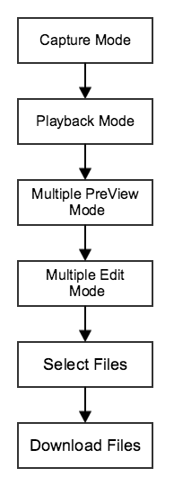

流程：setCameraPlaybackMode->enterMultiplePreviewMode->enterMultipleEditMode->selectAllFilesInPage(根据具体情况)->downloadAllSelectedFiles->finishDownloadAllSelectedFiles

**HANDLER_SHOW_STITCHING_OR_NOT_DIALOG**弹出一个对话框，如果对刚刚拍摄的照片满意，则点击OK进行下载合成。

~~~java
case HANDLER_SHOW_STITCHING_OR_NOT_DIALOG:
{
    //capture complete,show dialog,user determing stitching or cancel
    DialogInterface.OnClickListener positiveButtonOnClickListener=new DialogInterface.OnClickListener()
    {
        @Override
        public void onClick(DialogInterface dialog, int which)
        {
            //set dji camera playback mode
            handler.sendMessage(handler.obtainMessage(HANDLER_SET_DJI_CAMERA_PALYBACK_MODE, ""));
        }
    };
    DialogInterface.OnClickListener negativeButtonOnClickListener=new DialogInterface.OnClickListener()
    {
        @Override
        public void onClick(DialogInterface dialog, int which)
        {
            handler.sendMessage(handler.obtainMessage(HANDLER_SET_STITCHING_BUTTON_TEXT,getString(R.string.one_key_panorama)));
            handler.sendMessage(handler.obtainMessage(HANDLER_ENABLE_STITCHING_BUTTON,""));
        }
    };
	break;
    new AlertDialog.Builder(MainActivity.this).setTitle("Message").setMessage("Capture complete,stitching?").setPositiveButton("OK", positiveButtonOnClickListener).setNegativeButton("Cancel", negativeButtonOnClickListener).show();
}
~~~

**HANDLER_SET_DJI_CAMERA_PALYBACK_MODE**设置相机回放模式：

~~~java
private final int HANDLER_SET_DJI_CAMERA_PALYBACK_MODE = 2003;
~~~

代码：

~~~java
case HANDLER_SET_DJI_CAMERA_PALYBACK_MODE:
{
    //set camera playback mode to pull back images
    showCommonMessage("Set camera playback mode");
    CameraMode mode_playback = CameraMode.Camera_PlayBack_Mode;
    DJIDrone.getDjiCamera().setCameraMode(mode_playback, new DJIExecuteResultCallback()
    {
        @Override
        public void onResult(DJIError mErr)
        {
            if(mErr.errorCode==DJIError.RESULT_OK)
            {
                //enter multi preview mode
                new Thread()
                {
                    public void run()
                    {
                        try
                        {
                            Thread.sleep(3000);
                        }
                        catch(InterruptedException e)
                        {
                            e.printStackTrace();
                        }
                        //enter multi preview mode
                        handler.sendMessage(handler.obtainMessage(HANDLER_SET_DJI_CAMERA_MULTI_PREVIEW_MODE, ""));
                    }
                }.start();
            }
            else
            {
                handler.sendMessage(handler.obtainMessage(HANDLER_SHOW_COMMON_MESSAGE, "Set camera playback mode failed"));
            }
        }
    });
    break;
}
~~~

**HANDLER_SET_DJI_CAMERA_MULTI_PREVIEW_MODE**进入多视图界面：

~~~java
private final int HANDLER_SET_DJI_CAMERA_MULTI_PREVIEW_MODE = 2004;
~~~

~~~java
case HANDLER_SET_DJI_CAMERA_MULTI_PREVIEW_MODE:
{
    //enter multi preview mode
    showCommonMessage("Enter multi preview mode");
    DJIDrone.getDjiCamera().enterMultiplePreviewMode(new DJIExecuteResultCallback()
    {
        @Override
        public void onResult(DJIError mErr)
        {
            if(mErr.errorCode==DJIError.RESULT_OK)
            {
                new Thread()
                {
                    public void run()
                    {
                        try
                        {
                            Thread.sleep(3000);
                        }
                        catch(InterruptedException e)
                        {
                            e.printStackTrace();
                        }
                        //enter multi edit mode
                        handler.sendMessage(handler.obtainMessage(HANDLER_SET_DJI_CAMERA_MULTI_EDIT_MODE, ""));
                    }
                }.start();
            }
            else
            {
                handler.sendMessage(handler.obtainMessage(HANDLER_SHOW_COMMON_MESSAGE, "Enter multi preview mode failed"));
            }
        }
    });
    break;
}
~~~

**HANDLER_SET_DJI_CAMERA_MULTI_EDIT_MODE**进入多选模式：

~~~java
private final int HANDLER_SET_DJI_CAMERA_MULTI_EDIT_MODE = 2005;
~~~

~~~java
case HANDLER_SET_DJI_CAMERA_MULTI_EDIT_MODE:
{
    //enter multi edit mode
    showCommonMessage("Enter multi edit mode");
    DJIDrone.getDjiCamera().enterMultipleEditMode(new DJIExecuteResultCallback()
    {
        @Override
        public void onResult(DJIError mErr)
        {
            if(mErr.errorCode==DJIError.RESULT_OK)
            {
                new Thread()
                {
                    public void run()
                    {
                        try
                        {
                            Thread.sleep(3000);
                        }
                        catch(InterruptedException e)
                        {
                            e.printStackTrace();
                        }
                        //select page(max 8)
                        handler.sendMessage(handler.obtainMessage(HANDLER_SET_DJI_CAMERA_SELECT_PAGE, ""));
                    }
                }.start();
            }
            else
            {
                handler.sendMessage(handler.obtainMessage(HANDLER_SHOW_COMMON_MESSAGE, "Enter multi edit mode failed"));
            }
        }
    });
    break;
}
~~~

### 选择图片

~~~java
private final int HANDLER_SET_DJI_CAMERA_SELECT_PAGE = 2006;
~~~

~~~java
case HANDLER_SET_DJI_CAMERA_SELECT_PAGE:
{
    //select page(max 8)
    showCommonMessage("Select all file in page");
    DJIDrone.getDjiCamera().selectAllFilesInPage(new DJIExecuteResultCallback()
    {
        @Override
        public void onResult(DJIError mErr)
        {
            if(mErr.errorCode==DJIError.RESULT_OK)
            {
                new Thread()
                {
                    public void run()
                    {
                        try
                        {
                            Thread.sleep(3000);
                        }
                        catch(InterruptedException e)
                        {
                            e.printStackTrace();
                        }
                        if(numbersOfSelected<CAPTURE_IMAGE_NUMBER)
                        {
                            //enter previous page
                            handler.sendMessage(handler.obtainMessage(HANDLER_SET_DJI_CAMERA_PREVIOUS_PAGE, ""));
                        }
                        else
                        {
                            //download selected
                            handler.sendMessage(handler.obtainMessage(HANDLER_SET_DJI_CAMERA_DOWNLOAD_SELECTED, ""));
                        }
                    }
                }.start();
            }
            else
            {
                handler.sendMessage(handler.obtainMessage(HANDLER_SHOW_COMMON_MESSAGE, "Select all file in page failed"));
            }
        }
        
    });
    break;
}
~~~

选择剩余的照片：

~~~java
private final int HANDLER_SET_DJI_CAMERA_PREVIOUS_PAGE = 2007;
private final int HANDLER_SET_DJI_CAMERA_SELECT_FILE_AT_INDEX = 2008;
~~~

~~~java
case HANDLER_SET_DJI_CAMERA_PREVIOUS_PAGE:
{
    //if no enough in this page,go back previous page
    showCommonMessage("No enough images,go back previous page");
    DJIDrone.getDjiCamera().multiplePreviewPreviousPage(new DJIExecuteResultCallback()
    {
        @Override
        public void onResult(DJIError mErr)
        {
            if(mErr.errorCode==DJIError.RESULT_OK)
            {
                new Thread()
                {
                    public void run()
                    {
                        try
                        {
                            Thread.sleep(3000);
                        }
                        catch(InterruptedException e)
                        {
                            e.printStackTrace();
                        }
                        //go back previous page
                        handler.sendMessage(handler.obtainMessage(HANDLER_SET_DJI_CAMERA_SELECT_FILE_AT_INDEX, ""));
                    }
                }.start();
            }
            else
            {
                handler.sendMessage(handler.obtainMessage(HANDLER_SHOW_COMMON_MESSAGE, "Go back previous page failed"));
            }
        }
    });
    break;
}
~~~

**multiplePreviewPreviousPage()**返回前一页：

~~~java
case HANDLER_SET_DJI_CAMERA_SELECT_FILE_AT_INDEX:
{
    new Thread()
    {
        public void run()
        {
            showCommonMessage("Select rest "+(CAPTURE_IMAGE_NUMBER-numbersOfSelected)+" images");
            for(int i=numbersOfSelected;i<CAPTURE_IMAGE_NUMBER;i++)
            {
                //select single file
                DJIDrone.getDjiCamera().selectFileAtIndex(i, new DJIExecuteResultCallback()
                {
                    @Override
                    public void onResult(DJIError mErr)
                    {
                        if(mErr.errorCode==DJIError.RESULT_OK)
                        {
                            
                        }
                        else
                        {
                            
                        }
                    }
                });
                try
                {
                    Thread.sleep(1000);
                }
                catch (InterruptedException e)
                {
                    e.printStackTrace();
                }
            }
            try
            {
                Thread.sleep(1000);
            }
            catch (InterruptedException e)
            {
                e.printStackTrace();
            }
            //download selected
            handler.sendMessage(handler.obtainMessage(HANDLER_SET_DJI_CAMERA_DOWNLOAD_SELECTED, ""));
        }
    }.start();
    break;
}
~~~

**selectFileAtIndex()**选择需要的照片。

### 下载照片

 **HANDLER_SET_DJI_CAMERA_DOWNLOAD_SELECTED**下载照片:

~~~java
private final int HANDLER_SET_DJI_CAMERA_DOWNLOAD_SELECTED = 2009;
~~~

~~~java
private final String DOWNLOAD_IMAGE_DIRECTORY = "APPNAME";
private boolean isCheckDownloadImageFailure = false;
private int downloadImageFailedCount = 0;
~~~

~~~java
private void showDownloadProgressDialog()
{
    if(mDownloadDialog != null)
    {
        mDownloadDialog.show();
        mDownloadDialog.setProgress(0);
    }
}

private void hideDownloadProgressDialog() {
    if (null != mDownloadDialog && mDownloadDialog.isShowing())
    {
        mDownloadDialog.dismiss();
    }
}
~~~

下载照片：

~~~java
case HANDLER_SET_DJI_CAMERA_DOWNLOAD_SELECTED:
{
    //download file
    DJIDrone.getDjiCamera().downloadAllSelectedFiles(DOWNLOAD_IMAGE_DIRECTORY,new DJIFileDownloadCallBack()
    {
        @Override
        public void OnStart()
        {
            runOnUiThread(new Runnable()
            {               
                @Override
                public void run()
                {
                    showDownloadProgressDialog();
                }
            });
        }
        
        @Override
        public void OnError(Exception exception)
        {
            if(isCheckDownloadImageFailure)
            {
                downloadImageFailedCount++;
                handler.sendMessage(handler.obtainMessage(HANDLER_SHOW_COMMON_MESSAGE, "Downloading images on error"));
            }
        }
        
        @Override
        public void OnEnd()
        {
            new Thread()
            {
                public void run()
                {
                    handler.sendMessage(handler.obtainMessage(HANDLER_SET_DJI_CAMERA_FINISH_DOWNLOAD_FILES,""));
                    handler.sendMessage(handler.obtainMessage(HANDLER_SHOW_COMMON_MESSAGE, "Download finished"));
                    try
                    {
                        Thread.sleep(3000);
                    }
                    catch (InterruptedException e)
                    {
                        e.printStackTrace();
                    }
                    handler.sendMessage(handler.obtainMessage(HANDLER_SET_DJI_CAMERA_CAPTURE_MODE,""));
                    try
                    {
                        Thread.sleep(3000);
                    }
                    catch (InterruptedException e)
                    {
                        e.printStackTrace();
                    }
                    //some images download failed
                    if(downloadImageFailedCount!=0)
                    {
                        handler.sendMessage(handler.obtainMessage(HANDLER_SHOW_COMMON_MESSAGE, "Check "+downloadImageFailedCount+" images download failed,Task Abort!"));
                        downloadImageFailedCount=0;
                        handler.sendMessage(handler.obtainMessage(HANDLER_SET_STITCHING_BUTTON_TEXT,getString(R.string.one_key_panorama)));
                        handler.sendMessage(handler.obtainMessage(HANDLER_ENABLE_STITCHING_BUTTON,""));
                    }
                    else
                    {
                        handler.sendMessage(handler.obtainMessage(HANDLER_SHOW_COMMON_MESSAGE, "Check "+CAPTURE_IMAGE_NUMBER+" images download all success,stitching...."));
                        try
                        {
                            Thread.sleep(3000);
                        }
                        catch (InterruptedException e)
                        {
                            e.printStackTrace();
                        }
                        handler.sendMessage(handler.obtainMessage(HANDLER_START_STITCHING,""));
                    }
                }
            }.start();
        }
        
        @Override
        public void OnProgressUpdate(final int progress)
        {
            runOnUiThread(new Runnable()
            {
                @Override
                public void run()
                {
                    if(mDownloadDialog!=null)
                    {
                        mDownloadDialog.setProgress(progress);
                    }
                    if(progress>=100)
                    {
                        hideDownloadProgressDialog();
                    }
                }
            });
        }
    });
    break;
}
~~~

 **downloadAllSelectedFiles()**有以下几种状态：
 
 - **OnStart()** 调用 **showDownloadProgressDialog()**

 - **OnError()** 下载失败

 - **OnProgressUpdate()** 更新进度条

 - **OnEnd()** 下载完成

~~~java
private final int HANDLER_START_STITCHING = 1002;
private final int HANDLER_SET_DJI_CAMERA_CAPTURE_MODE = 2002;
private final int HANDLER_SET_DJI_CAMERA_FINISH_DOWNLOAD_FILES = 2010;
~~~

~~~java
case HANDLER_SET_DJI_CAMERA_FINISH_DOWNLOAD_FILES:
{
    //finish download
    DJIDrone.getDjiCamera().finishDownloadAllSelectedFiles(new DJIExecuteResultCallback()
    {
        @Override
        public void onResult(DJIError mErr)
        {
            if(mErr.errorCode==DJIError.RESULT_OK)
            {
                handler.sendMessage(handler.obtainMessage(HANDLER_SHOW_COMMON_MESSAGE, "Finished download"));
            }
            else
            {
                handler.sendMessage(handler.obtainMessage(HANDLER_SHOW_COMMON_MESSAGE, "Finished download failed"));
            }
        }
    });
    break;
}
case HANDLER_SET_DJI_CAMERA_CAPTURE_MODE:
{
    CameraMode mode=CameraMode.Camera_Capture_Mode;
    DJIDrone.getDjiCamera().setCameraMode(mode, new DJIExecuteResultCallback()
    {
        @Override
        public void onResult(DJIError mErr)
        {
            if(mErr.errorCode==DJIError.RESULT_OK)
            {
                
            }
            else
            {
                handler.sendMessage(handler.obtainMessage(HANDLER_SHOW_COMMON_MESSAGE, "Set camera capture mode failed"));
            }
        }
    });
    break;
}
case HANDLER_START_STITCHING:
{
    // Start stitching
    break;
}
~~~

运行程序。

## 生成全景图

### 合成照片

我们已经将八张照片下载到本地了。

~~~java
private boolean isDIsableDJIVideoPreviewDuringStitching = true; // Disable video preview during stitching to save CPU and memory usage. 
																//Change this boolean to false to keep video preview enabled
private boolean isStitchingCompleted = false;
private String stitchingResultImagePath="";
private final double STITCH_IMAGE_SCALE = 0.5;
private final int HANDLER_ENABLE_DJI_VIDEO_PREVIEW = 2011;
private final int HANDLER_DISABLE_DJI_VIDEO_PREVIEW = 2012;

public native int jnistitching(String[] source,String result,double scale);
~~~

**HANDLER_START_STITCHING**中添加以下代码:

~~~java
case HANDLER_START_STITCHING:
{
    if(isDIsableDJIVideoPreviewDuringStitching)
    {
        new Thread()
        {
            public void run()
            {
                handler.sendMessage(handler.obtainMessage(HANDLER_DISABLE_DJI_VIDEO_PREVIEW,""));  //disable dji video preview
                while(isStitchingCompleted==false)
                {
                    handler.sendMessage(handler.obtainMessage(HANDLER_SHOW_COMMON_MESSAGE, getString(R.string.video_preview_disabled_during_stitching)));
                    try
                    {
                        sleep(4000);
                    }
                    catch(InterruptedException e)
                    {
                        e.printStackTrace();
                    }
                }
            }
        }.start();
    }

    handler.sendMessage(handler.obtainMessage(HANDLER_SET_STITCHING_BUTTON_TEXT,"Stitching...."));
    new Thread()
    {
        public void run()
        {
            isStitchingCompleted=false;
            String[] source=getDirectoryFilelist(STITCHING_SOURCE_IMAGES_DIRECTORY);
            stitchingResultImagePath=STITCHING_RESULT_IMAGES_DIRECTORY+getCurrentDateTime()+"result.jpg";
            if(jnistitching(source, stitchingResultImagePath, STITCH_IMAGE_SCALE)==0)
            {
                handler.sendMessage(handler.obtainMessage(HANDLER_SET_STITCHING_BUTTON_TEXT,"Stitching success"));
            }
            else
            {
                handler.sendMessage(handler.obtainMessage(HANDLER_SET_STITCHING_BUTTON_TEXT,"Stitching error"));
            }
            handler.sendMessage(handler.obtainMessage(HANDLER_SET_STITCHING_BUTTON_TEXT,getString(R.string.one_key_panorama)));
            handler.sendMessage(handler.obtainMessage(HANDLER_ENABLE_STITCHING_BUTTON,""));
            handler.sendMessage(handler.obtainMessage(HANDLER_ENABLE_DJI_VIDEO_PREVIEW,""));
            isStitchingCompleted=true;
        }
    }.start();
    break;
}
~~~

关闭和开启实时视频预览:

~~~java
case HANDLER_DISABLE_DJI_VIDEO_PREVIEW:
{
    DJIDrone.getDjiCamera().setReceivedVideoDataCallBack(null);
    break;
}
case HANDLER_ENABLE_DJI_VIDEO_PREVIEW:
{
    DJIDrone.getDjiCamera().setReceivedVideoDataCallBack(mReceivedVideoDataCallBack);
    break;
}
~~~

~~~java
private String[] getDirectoryFilelist(String directory)
{
    String[] filelist;
    File sourceDirectory = new File(STITCHING_SOURCE_IMAGES_DIRECTORY);
    int index=0;
    int folderCount=0;
    //except folders
    for(File file : sourceDirectory.listFiles())
    {
        if(file.isDirectory())
        {
            folderCount++;
        }
    }
    filelist=new String[sourceDirectory.listFiles().length-folderCount];
    for(File file : sourceDirectory.listFiles())
    {
        if(!file.isDirectory())
        {
            //showLOG("getFilelist file:"+file.getPath());
            filelist[index]=file.getPath();
            index++;
        }
    }
    return filelist;
}

private String getCurrentDateTime()
{
    Calendar c = Calendar .getInstance();
    SimpleDateFormat df = new SimpleDateFormat("yyyyMMddHHmmss",Locale.getDefault());
    return df.format(c.getTime());
}
~~~

调用jni代码合成全景：

~~~java
public native int jnistitching(String[] source,String result,double scale);
~~~

鼠标右键单击项目 -> Android Tools -> Add Native Support. 如下：

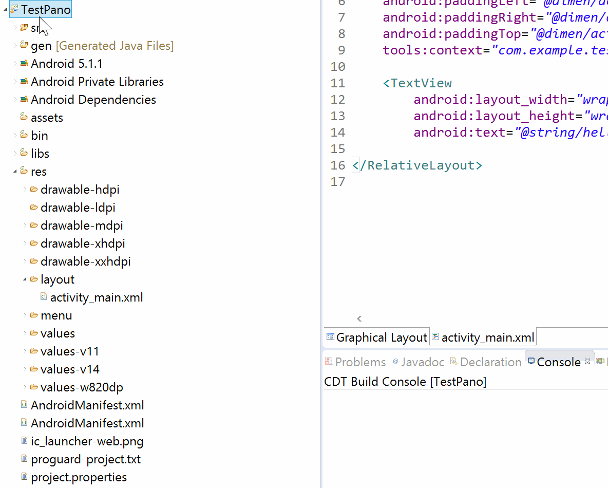

参照**PanoDemo**设置：

~~~
LOCAL_MODULE    := PanoDemo // Replace with your own app's name
LOCAL_SRC_FILES := PanoDemo.cpp // Here too
~~~

如下：

~~~cpp
JNIEXPORT jstring JNICALL Java_com_dji_dev_panodemo_MainActivity_testjni(JNIEnv *env, jobject obj);
...
JNIEXPORT jint JNICALL Java_com_dji_dev_panodemo_MainActivity_jnistitching(JNIEnv *env, jobject obj, jobjectArray source, jstring result, jdouble scale);
...
JNIEXPORT jstring JNICALL Java_com_dji_dev_panodemo_MainActivity_testjni(JNIEnv *env, jobject obj)
...
JNIEXPORT jint JNICALL Java_com_dji_dev_panodemo_MainActivity_jnistitching(JNIEnv *env, jobject obj, jobjectArray source, jstring result, jdouble scale)
~~~

~~~java
private void javaShowJniStitchingCostTime(double costTime)
{
	// Show jnistitching cost time
}
~~~

加载库：

~~~java
//Load jni library
static
{
	System.loadLibrary("APPNAME");
}
~~~

成功了。

### 显示全景图

**javaShowJniStitchingCostTime()**函数如下：

~~~java
private void javaShowJniStitchingCostTime(double costTime)
{
    handler.sendMessage(handler.obtainMessage(HANDLER_JAVA_SHOW_JNI_STITCHING_COST_TIME,""+costTime));
}
~~~

~~~
private final int HANDLER_JAVA_SHOW_JNI_STITCHING_COST_TIME = 1004;
~~~

~~~java
case HANDLER_JAVA_SHOW_JNI_STITCHING_COST_TIME:
{
    String costTime_str=(String)msg.obj;  //original str like this:19.492691
    costTime_str=costTime_str.substring(0, costTime_str.indexOf('.')+2);  //result like this:19.4
    showLOG("java:jniStitching cost time= "+costTime_str+" seconds");
    //show open or done dialog
    DialogInterface.OnClickListener positiveButtonOnClickListener=new DialogInterface.OnClickListener()
    {
        @Override
        public void onClick(DialogInterface dialog, int which)
        {
            //set dji camera playback mode
            handler.sendMessage(handler.obtainMessage(HANDLER_SHOW_STITCHING_RESULT_IMAGEVIEW, ""));
        }
        
    };
    new AlertDialog.Builder(MainActivity.this).setTitle("Stitching success").setMessage("Cost time "+costTime_str+" seconds").setPositiveButton("Open", positiveButtonOnClickListener).setNegativeButton("Done", null).show();
    break;
}
~~~

**HANDLER_SHOW_STITCHING_RESULT_IMAGEVIEW**显示全景图：

~~~java
private final int HANDLER_SHOW_STITCHING_RESULT_IMAGEVIEW = 1006;
~~~

~~~java
case HANDLER_SHOW_STITCHING_RESULT_IMAGEVIEW:
{
    //use android system imageview
    File file = new File(stitchingResultImagePath);
    if(file != null && file.isFile())
    {
        Intent intent = new Intent();
        intent.setAction(android.content.Intent.ACTION_VIEW);
        intent.setDataAndType(Uri.fromFile(file), "image/*");
        startActivity(intent);   
    }
    break;
}
~~~

## 最后

### 适配Phantom 3 Professional

Inspire1和Phantom 3 Professional区别主要在照片的拍摄方式上。

Inspire1旋转云台360度，Phantom 3 Professional旋转机身。

~~~java
mDroneType = DJIDrone.getDroneType();
~~~

选择代码如下：

~~~java
if(mDroneType==DJIDroneType.DJIDrone_Inspire1)
{
    handler.sendMessage(handler.obtainMessage(HANDLER_INSPIRE1_CAPTURE_IMAGES,""));
}

// Suppot Phantom 3 Professional
else if(mDroneType==DJIDroneType.DJIDrone_Phantom3_Professional)
{
    handler.sendMessage(handler.obtainMessage(HANDLER_PHANTOM3PROFESSIONAL_CAPTURE_IMAGES,""));
}

else
{
    showCommonMessage(getString(R.string.unsupported_drone));
}
~~~

**HANDLER_PHANTOM3PROFESSIONAL_CAPTURE_IMAGES**代码如下：

~~~java
case HANDLER_PHANTOM3PROFESSIONAL_CAPTURE_IMAGES:
{
    new Thread()
    {
        public void run()
        {
            isGroundstationOpenSuccess=false;
            DJIDrone.getDjiGroundStation().openGroundStation(new DJIGroundStationExecuteCallBack()
            {
                @Override
                public void onResult(GroundStationResult result)
                {
                    handler.sendMessage(handler.obtainMessage(HANDLER_SHOW_COMMON_MESSAGE, result.toString()));
                    if(result==GroundStationResult.GS_Result_Successed)
                    {
                        isGroundstationOpenSuccess=true;
                    }
                }
            });
            try
            {
                sleep(3000);
            }
            catch(InterruptedException e)
            {
                e.printStackTrace();
            }
            if(isGroundstationOpenSuccess==false)
            {
                handler.sendMessage(handler.obtainMessage(HANDLER_SET_STITCHING_BUTTON_TEXT,getString(R.string.one_key_panorama)));
                handler.sendMessage(handler.obtainMessage(HANDLER_ENABLE_STITCHING_BUTTON,""));
                return;
            }
            showCommonMessage(getString(R.string.groundstation_take_control));
            try
            {
                sleep(3000);
            }
            catch(InterruptedException e)
            {
                e.printStackTrace();
            }
            showCommonMessage("Set yaw control mode to angle");
            DJIDrone.getDjiGroundStation().setYawControlMode(DJINavigationFlightControlYawControlMode.Navigation_Flight_Control_Yaw_Control_Angle);
            try
            {
                sleep(3000);
            }
            catch(InterruptedException e)
            {
                e.printStackTrace();
            }
            //rotate yaw to take photos
            int imgIndex=0;
            for(int i=0;i<180;i+=(360/CAPTURE_IMAGE_NUMBER))
            {
                imgIndex++;
                showCommonMessage(getString(R.string.capturing_image)+" "+imgIndex+"/"+CAPTURE_IMAGE_NUMBER);
                DJIDrone.getDjiGroundStation().sendFlightControlData(i, 0, 0, 0, new DJIExecuteResultCallback()
                {
                    @Override
                    public void onResult(DJIError mErr)
                    {
                        if(mErr.errorCode==DJIError.RESULT_OK)
                        {
                            
                        }
                        else
                        {
                            
                        }
                    }
                });
                try
                {
                    sleep(4000);
                }
                catch(InterruptedException e)
                {
                    e.printStackTrace();
                }
                DJICameraTakePhoto();
                try
                {
                    sleep(3000);
                }
                catch(InterruptedException e)
                {
                    e.printStackTrace();
                }
            }
            for(int i=-180;i<0;i+=(360/CAPTURE_IMAGE_NUMBER))
            {
                imgIndex++;
                showCommonMessage(getString(R.string.capturing_image)+imgIndex+"/"+CAPTURE_IMAGE_NUMBER);
                DJIDrone.getDjiGroundStation().sendFlightControlData(i, 0, 0, 0, new DJIExecuteResultCallback()
                {
                    @Override
                    public void onResult(DJIError mErr)
                    {
                        if(mErr.errorCode==DJIError.RESULT_OK)
                        {
                            
                        }
                        else
                        {
                            
                        }
                    }
                });
                try
                {
                    sleep(4000);
                }
                catch(InterruptedException e)
                {
                    e.printStackTrace();
                }
                DJICameraTakePhoto();
                try
                {
                    sleep(3000);
                }
                catch(InterruptedException e)
                {
                    e.printStackTrace();
                }
            }
            //yaw back to init
            showCommonMessage(getString(R.string.capture_image_complete));
            DJIDrone.getDjiGroundStation().sendFlightControlData(0, 0, 0, 0, new DJIExecuteResultCallback()
            {
                @Override
                public void onResult(DJIError mErr)
                {
                    if(mErr.errorCode==DJIError.RESULT_OK)
                    {
                        
                    }
                    else
                    {
                        
                    }
                }
            });
            try
            {
                sleep(4000);
            }
            catch(InterruptedException e)
            {
                e.printStackTrace();
            }
            //close groundstation
            DJIDrone.getDjiGroundStation().closeGroundStation(new DJIGroundStationExecuteCallBack()
            {
                @Override
                public void onResult(GroundStationResult result)
                {
                    handler.sendMessage(handler.obtainMessage(HANDLER_SHOW_COMMON_MESSAGE, result.toString()));
                }
            });
            showCommonMessage(getString(R.string.capture_image_complete));
            try
            {
                Thread.sleep(3000);
            }
            catch(InterruptedException e)
            {
                e.printStackTrace();
            }
            if(captureImageFailedCount!=0)
            {
                showCommonMessage("Check "+captureImageFailedCount+" images capture failed,Task Abort!");
                captureImageFailedCount=0;
                handler.sendMessage(handler.obtainMessage(HANDLER_SET_STITCHING_BUTTON_TEXT,getString(R.string.one_key_panorama)));
                handler.sendMessage(handler.obtainMessage(HANDLER_ENABLE_STITCHING_BUTTON,""));
            }
            else
            {
                showCommonMessage("Check "+CAPTURE_IMAGE_NUMBER+" images capture all success,continue....");
                try
                {
                    Thread.sleep(3000);
                }
                catch (InterruptedException e)
                {
                    e.printStackTrace();
                }
                //show dialog
                handler.sendMessage(handler.obtainMessage(HANDLER_SHOW_STITCHING_OR_NOT_DIALOG, ""));
            }
        }
    }.start();
    break;
}
~~~

这里使用地面站控制。

### Android生命周期

**onResume()** 和 **onPause()**：

~~~java
@Override
protected void onResume()
{
    super.onResume();
    ServiceManager.getInstance().pauseService(false); // Resume the DJIAoa service
}

@Override
protected void onPause()
{
    super.onPause();
    ServiceManager.getInstance().pauseService(true); // Pause the DJIAoa service
}
~~~

onDestroy()：

~~~java
@Override
protected void onDestroy()
{
    destroyDJICamera();
    DJIDrone.disconnectToDrone();
    showLOG("MainActivity onDestroy()");
    super.onDestroy();
}

private void destroyDJICamera()
{
    checkCameraConnectionTimer.cancel();
    if(DJIDrone.getDjiCamera()!=null)
    {
        DJIDrone.getDjiCamera().setReceivedVideoDataCallBack(null);
        mDjiGLSurfaceView.destroy();
        DJIDrone.getDjiGimbal().setGimbalUpdateAttitudeCallBack(null);
        DJIDrone.getDjiGimbal().setGimbalErrorCallBack(null);
        
        DJIDrone.getDjiGimbal().stopUpdateTimer();
        DJIDrone.getDjiBattery().stopUpdateTimer();
    }
}
~~~

### 电量显示

电量是非常重要的

**activity_main.xml**代码如下：

~~~xml
<TextView
    android:id="@+id/batteryTextView"
    android:layout_width="wrap_content"
    android:layout_height="wrap_content"
    android:layout_alignParentBottom="true"
    android:layout_alignParentEnd="true"
    android:layout_alignParentRight="true"
    android:text="@string/battery"
    android:textColor="@android:color/white" />
~~~

**initUIControls()**中：

~~~java
private TextView batteryTextView;
~~~

~~~java
private void initUIControls()
{
	...
    batteryTextView=(TextView)findViewById(R.id.batteryTextView);

	...

    //Customize controls
    batteryTextView.setText("");
}
~~~

**startDJICamera()**实现电量显示：

~~~java
mBattryUpdateInfoCallBack = new DJIBatteryUpdateInfoCallBack(){
    @Override
    public void onResult(final DJIBatteryProperty state)
    {
		runOnUiThread(new Runnable()
		{
			public void run()
			{
				batteryTextView.setText(getString(R.string.battery)+":"+state.remainPowerPercent+"%");
			}
		});
    }
};

DJIDrone.getDjiBattery().setBatteryUpdateInfoCallBack(mBattryUpdateInfoCallBack);
DJIDrone.getDjiBattery().startUpdateTimer(2000);
~~~

**remainPowerPercent**获取电量百分比。

在**destroyDJICamera**中添加：

~~~java
DJIDrone.getDjiBattery().setBatteryUpdateInfoCallBack(null);
~~~

完成。

### 总结

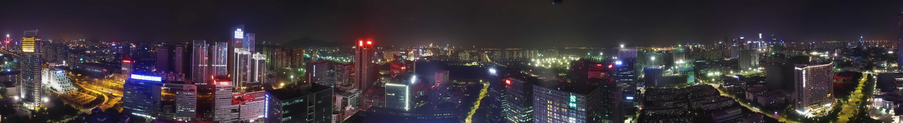

你已经完成：

- 连接飞行器，显示实时预览画面。

- 控制云台或者机身。

- 拍照。

- 从回放模式中下载照片。

- 使用NDK代码合成全景图。
