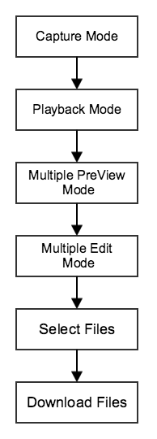

# PanoDemo

## An Android Panorama demo for DJI Inspire1 and Phantom 3 Professional using DJI SDK and OpenCV

### Develop environment:
jdk 8u45 + eclipse mars + ADT 23.0.6 + ndk r10e + cdt8.7.0 + cygwin2.1.0 + OpenCV2.4.11 + DJI SDK 2.1.0

### Necessary software installing and configuring guides:

1.jdk: [http://www.ntu.edu.sg/home/ehchua/programming/howto/JDK_Howto.html]()

2.eclipse: [http://www.eclipse.org/downloads/]()

3.adt: [http://developer.android.com/sdk/installing/installing-adt.html]()

4.ndk: [http://developer.android.com/ndk/guides/setup.html]()

5.cdt: [http://eclipse.org/cdt/]()

6.cygwin: [http://www.cygwin.com]()

7.OpenCV:[http://opencv.org]()

8.DJI SDK:[http://dev.dji.com]()

### Import Projects to your eclipse:

1.Open Eclipse--File--Import--General--Existing Projects into Workspace--Select root directory--Browse:


2.Select following 3 projects:


3.Finish,wait projects build complete,check EvanPano's Library:

4.Run APP:

### Download images from DJI drone diagram:

### Cropping panorama algorithm:

Uncropped panorama:

cropped panorama:

